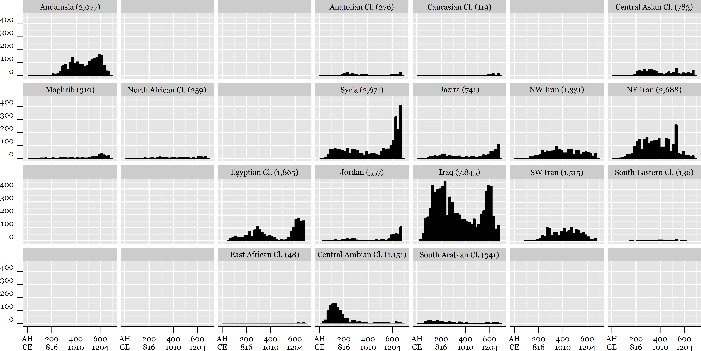
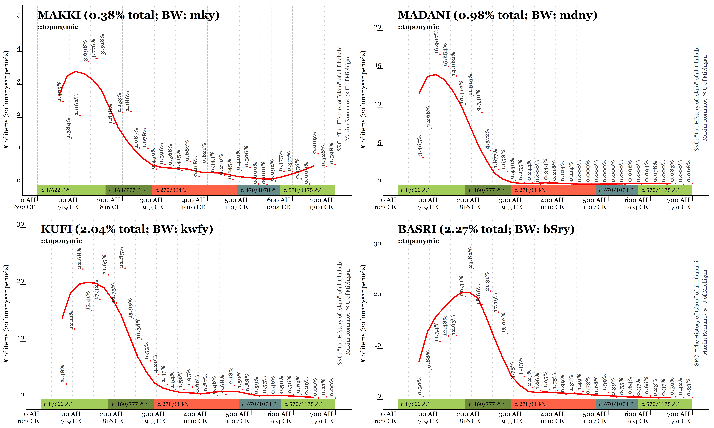
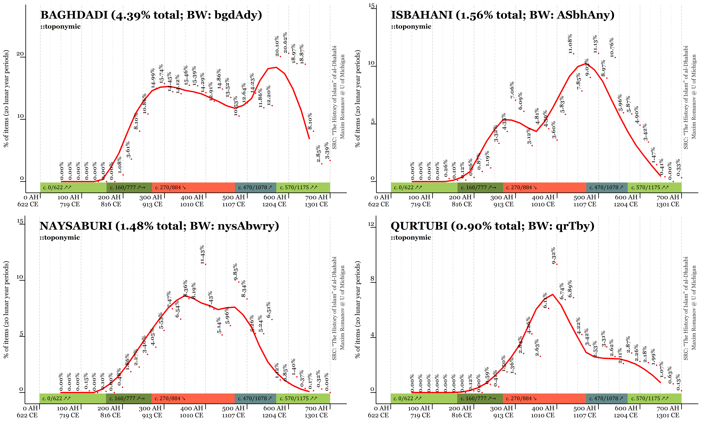
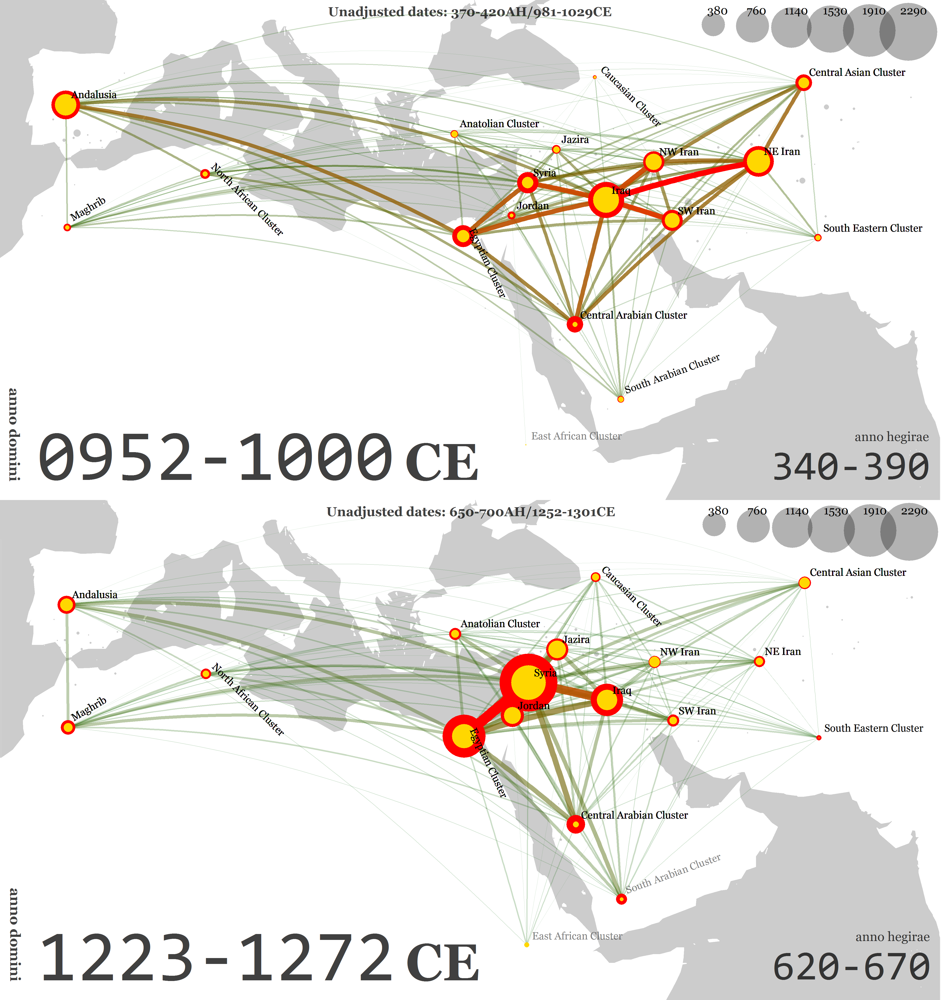
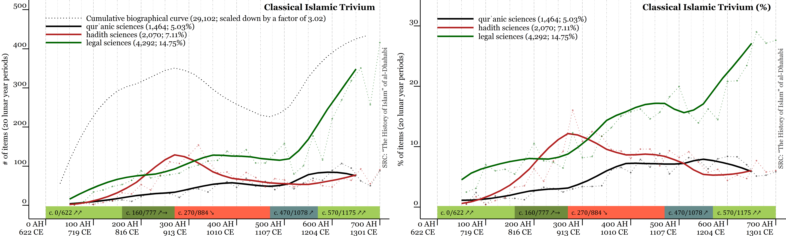
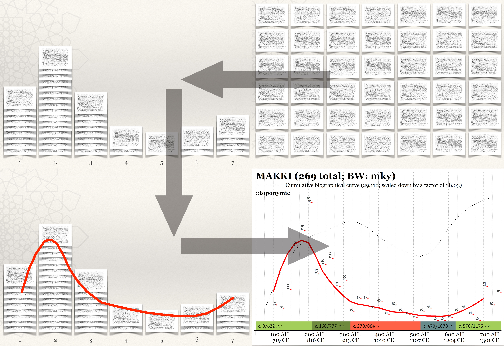
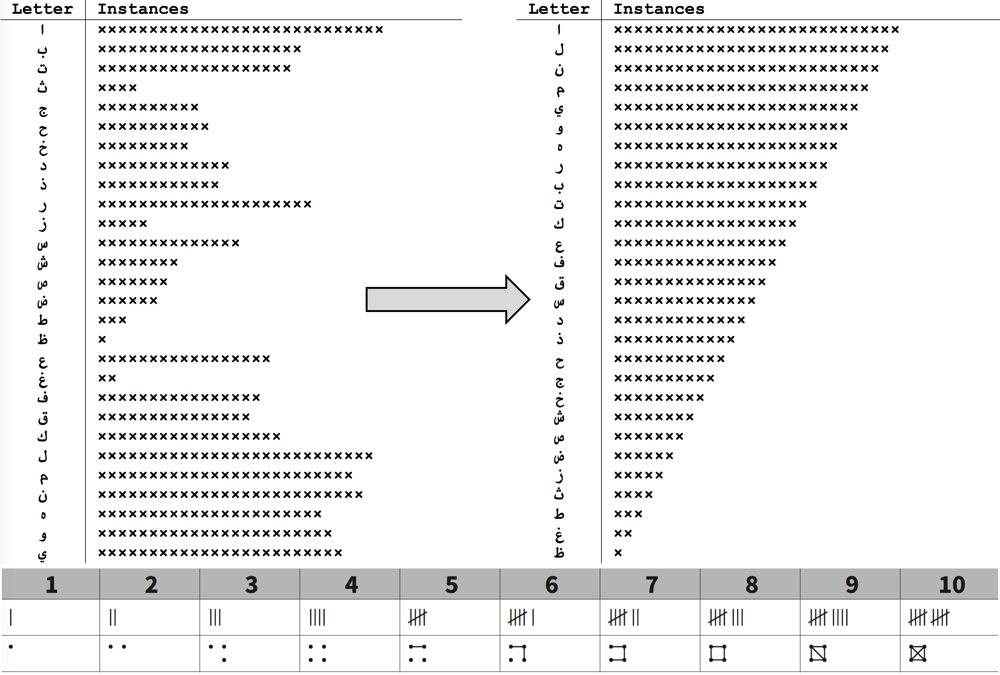
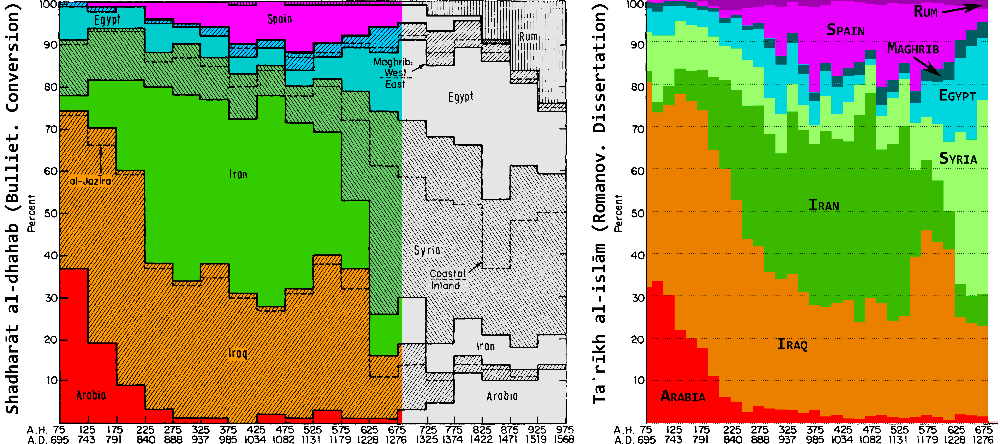

> The comparison of the results of the computational analysis of the *Taʾrīḫ al-islām*, al-Ḏahabī’s 50-volume biographical collection, with brief statements that describe the rise and decline of cities and provinces of the Islamic world from the *al-Amṣār ḏawāt al-āṯār*, al-Ḏahabī’s 4-folio epistle, suggests that al-Ḏahabī had a solid grasp of the tremendous amount of biographical and historical data that he collected, and that his short epistle may be regarded as a missing analytical summary of the most ambitious historical project in the pre-modern Islamic world. In the light of results, we perhaps may think of al-Ḏahabī as one of the earliest quantitative historians. Although we do not have conclusive evidence about al-Ḏahabī—or any other Islamic historian—the paper argues that all necessary mathematical, visual and ‘mechanical’ techniques already existed, and that historians could have been used them.

<blockquote>

<em>If a hammer in a hand makes everything look like nails,</em> <em>wouldn't lots of nails beg for something</em> <em>that works like a hammer?</em>

</blockquote>

<h1 id="introduction">Introduction</h1>

Analyzing quantifiable data from vast biographical collections, one may get puzzled with a question whether the author of a certain biographical collection had some sense of the data that he put together. Could his familiarity with the data have led him to observations similar to what we can discover relying on advanced graphing techniques of time-series analysis? A professor<a href="#fn1" class="footnoteRef" id="fnref1">1</a> at the University of Michigan posed this question to me when I was discussing with him some early results of my computational analysis of al-Ḏahabī’s <em>Taʾrīḫ al-islām</em>,<a href="#fn2" class="footnoteRef" id="fnref2">2</a> at the moment being utterly overwhelmed by the avalanche of frequency lists, graphs, cartograms, collocation tables and word clouds.<a href="#fn3" class="footnoteRef" id="fnref3">3</a>

“[O]ne of the most ambitious histories of the entire world of Islam,”<a href="#fn4" class="footnoteRef" id="fnref4">4</a> the <em>Taʾrīḫ al-islām</em> is a 50-volume mammoth of Islamic biographical literature that covers the first seven centuries of Islamic history and includes over 30,000<a href="#fn5" class="footnoteRef" id="fnref5">5</a> biographical records arranged chronologically into decades. However, this giant book lacks anything that could offer even a preliminary answer to whether al-Ḏahabī had any sense of his historical and geographical data. Even though al-Ḏahabī frequently comments on specific events and individuals, nowhere in the <em>Taʾrīḫ al-islām</em> does he attempt to put his historical data into some analytical perspective: the book has no concluding part and features only a brief introduction that consists mostly of the list of over forty sources that he used for its composition.

It seems that an unusually brief work of al-Ḏahabī—<em>al-Amṣār ḏawāt al-āṯār</em> (“Cities and ports for hearing the reports”)<a href="#fn6" class="footnoteRef" id="fnref6">6</a>—may shed light on this issue. The exact opposite of the <em>Taʾrīḫ al-islām</em>, the <em>Amṣār</em> is but a 4-folio epistle where al-Ḏahabī briefly characterizes the role of different urban centers and provinces of the Islamic world in Ḥadīṯ scholarship up to his own time. Unlike most of al-Ḏahabī’s works whose focus is on individuals, the subject of the <em>Amṣār</em> is on cultural geography; most interestingly, al-Ḏahabī occasionally characterizes periods when these centers thrived by using direct or indirect chronological statements: in the case of direct statements, he explicitely names periods;<a href="#fn7" class="footnoteRef" id="fnref7">7</a> alternatively, he refers to specific generations or particular individuals.

The <em>Amṣār</em> has already attracted its share of scholarly attention, and modern scholars who studied this epistle tend to agree with al-Ḏahabī’s assessments. However, existing assessments of al-Ḏahabī’s <em>Amṣār</em> are methodologically problematic, since they are based either on al-Ḏahabī’s reputation as a prominent Ḥadīṯ scholar,<a href="#fn8" class="footnoteRef" id="fnref8">8</a> or on evaluations of al-Ḏahabī’s own sample.<a href="#fn9" class="footnoteRef" id="fnref9">9</a> In many ways, scholarly attempts to assess the reliability of al-Ḏahabī’s statements in the <em>Amṣār</em> and the main question of the article are related, and a methodological solution that will be offered in what follows should shed light on both issues.

<h1 id="methodological-considerations">Methodological considerations</h1>

My previous work on al-Ḏahabī’s <em>Taʾrīḫ al-islām</em> allows me to compare the contents of this enormous collection with al-Ḏahabī’s brief statements from the <em>Amṣār</em>. The results should give us a better understanding of this short, but arguably crucial epistle, as well as to shed more light on al-Ḏahabī’s historical methodology.

The dataset formed from the <em>Taʾrīḫ al-islām</em> includes about 29,000 biographies of individuals who died in the period of <em>c</em>. 40–700/661–1300 CE.<a href="#fn10" class="footnoteRef" id="fnref10">10</a> The prevailing majority of individuals were included in the <em>Taʾrīḫ al-islām</em> because they were involved in the transmission of Ḥadīṯ (over 90%),<a href="#fn11" class="footnoteRef" id="fnref11">11</a> even though they did not necessarily make any noteworthy contributions to this area. Relying on onomastic data we can compare chronological curves of individuals associated with particular regions with al-Ḏahabī’s descriptions of those regions in the <em>Amṣār</em>.

Before we turn to the comparison of statements from the <em>Amṣār</em> and the graphs of relevant data from <em>Taʾrīḫ al-islām</em>, some methodological assumptions must be made explicit. The graphs that will follow are based on “descriptive names” (sing. <em>nisbaŧ</em>), and anyone who ever worked with biographical collections is likely to object that not every individual identified as, for example, “al-Madanī” was actually a Medinan, as well as there are Medinans who are not identified as such with this specific toponymic <em>nisbaŧ</em>, not to mention that the “descriptive name” al-Madanī (and its variation al-Madīnī) may refer to urban centers other than Medina.<a href="#fn12" class="footnoteRef" id="fnref12">12</a> The situation with “descriptive names” is indeed complicated, and such objections are not invalid. However, at this point of our understanding of overabundant Islamic onomastic data—as well as biographical data more broadly—both sides of the issue of whether we can or cannot use “descriptive names” at their face value is impossible to prove:<a href="#fn13" class="footnoteRef" id="fnref13">13</a> we simply do not know to what extent the presence of false positives (i.e., Madanīs who have nothing to do with Medina) and the absence of false negatives (i.e., the Medinans who are not identified as Madanīs) actually affects the overall picture. Until some solid data are provided to convincingly support either side of the issue, historians can operate only on the level of explicit methodological assumptions.

The case of the Muqaddasī family—the famous Ḥanbalī family of Banū Qudāmaŧ—is quite interesting from the perspective of relying on the face value of <em>nisbaŧ</em>s. The <em>nisbaŧ</em> “al-Maqdisī/al-Muqaddasī” refers to Jerusalem (Bayt al-Maqdis, or al-Bayt al-Muqaddas), and, technically, the family name al-Muqaddasī does refer to the region of Jerusalem. From the history of this clan we know that they indeed were the natives of Palestine, but as a strong scholarly family they appear only after they establish themselves in Damascus. In the <em>Amṣār</em> al-Ḏahabī writes that Jerusalem was never a center of learning, and as the data from the <em>Taʾrīḫ al-islām</em> shows, indeed there are almost no individuals with the name “al-Muqaddasī” until after 500/1107 CE—the period when Damascus becomes the leading center. It seems that in the scholarly circles the name “Jerusalemite” was not much in use, which allowed this toponymic name to be re-appropriated for a family one.

Although the situation may appear as confusing, it can be resolved through collocation analysis—that is by looking into what other <em>nisbaŧ</em>s describe individuals that bear the name “al-Muqaddasī.” In the <em>Amṣār</em>, al-Ḏahabī writes about the Muqaddasīs (al-Maqādisaŧ) in the context of Damascus, and—if we look at the <em>Taʾrīḫ al-islām</em>—the most frequent <em>nisbaŧ</em>s of the Muqaddasīs in the period of 500–700/1107–1301 CE are “al-Dimašqī” and “al-Ṣāliḥī,” with the first referring to the city of Damascus, and the second—to the Ḥanbalī quarter of this city. Similar <em>nisbaŧ</em> re-appropriation can be observed with other toponymic names as well. Referring to the town of Suhravard and the region of Ǧīlān (both in Iran), the <em>nisbaŧ</em>s “al-Suhrawardī” and “al-Ǧīl[ān]ī” feature in the <em>Taʾrīḫ al-islām</em> only when the Suhrawardī and the al-Ǧīl[ān]ī/Qādirī families are prominent in Baghdad (roughly late 12th–early 13th centuries CE), and—similarly to the case of the Muqaddasīs—the most frequent co-occurring <em>nisbaŧ</em> of both the Suhrawardīs and the al-Jīl[ān]īs during this period is “al-Baġdādī.” Such instances or re-appropriation are not frequent and happen only with <em>nisbaŧ</em>s that are not frequent; more importantly, the way my method is designed, the Muqaddasīs will be counted as Damascenes, and al-Suhrawardīs and al-Ǧīl[ān]īs as Baghdadis.

My computer-aided analysis of the <em>Taʾrīḫ al-islām</em> yields about 700 unique <em>nisbaŧ</em>s (with over 300 toponymic ones) that identify at least 10 different individuals; the overall number of these <em>nisbaŧ</em>s runs into over 70,000 instances, considering that individuals are often described with more than one <em>nisbaŧ</em>. While 70,000 data points can hardly be called “big data” by any scientific standards, this dataset is too big to make exact identification of each and every <em>nisbaŧ</em> possible. Thus, under these circumstances, treating <em>nisbaŧ</em>s at their face values is simply the most logical way to begin the large-scale analysis of biographical data. As our knowledge about the “behavior” of <em>nisbaŧ</em>s in biographical collections improves—and this can be achieved only through large-scale analysis—these methodological assumptions can be adjusted.<a href="#fn14" class="footnoteRef" id="fnref14">14</a> In addition, it should be stressed that the use of large datasets usually lower the possibility of error, while regression curves (here, the LOWESS curve) smooth out minor irregularities, making larger long-term trends more easily discernible.<a href="#fn15" class="footnoteRef" id="fnref15">15</a>

<h1 id="the-cultural-geography-of-the-amṣār">The Cultural Geography of the <em>Amṣār</em></h1>

al-Ḏahabī included over 80 urban centers and provinces in the <em>Amṣār</em>. Starting with the sacred cities of Islam he moves through the regions of al-Šām, al-ʿIrāq, Miṣr, al-Yaman, al-Andalus, the regions of al-Maġrib and Ifrīqiyya, al-Jazīraŧ, northwestern Iran, northeastern Iran (Ḫurāsān), Mā-warāʾ-al-nahr and Ḫwārizm, southern Iran (spanning from al-Ahwāz to Sijistān, all lumped together), and, in the very end, he briefly mentions the very fringes: al-Hind, al-Sind, Ḥaḍramawt, and al-Ḥabašaŧ. As his coverage shows, he is well familiar with the geography of the Islamic world, but his chronological statements are more or less certain—i.e., he names the periods of prosperity one way or another—only for about two dozen places, most of which feature in the first part of the epistle. Furthermore, not all of his descriptions are equally thorough and detailed, and it seems that the certainty of his statements and the level of details of his assessments in the <em>Amṣār</em> correspond to the amount of relevant data in the <em>Taʾrīḫ al-islām</em>: the more data he had in the <em>Taʾrīḫ al-islām</em>, the more certain and detailed were his statements in the <em>Amṣār</em>.

Figure 1. Graphs of chronological coverage of different regions in the <em>Taʾrīḫ al-islām</em> through toponymic <em>nisbaŧ</em>s.

Of particular interest are his chronological statements when he marks periods during which a region contributed most significantly to Ḥadīṯ sciences. In doing so, he names centuries (e.g., <em>al-miʾaŧ al-ṯānīyaŧ</em>, “the second [<em>hijrī</em>] century”) or gives a reference to milestone events (such as foundation, conquest, destruction); in other cases he names most prominent Ḥadīṯ scholars, from which the period of prosperity can be inferred.

In terms al-Ḏahabī’s evaluations, urban centers and provinces can be divided into three major groups: those that are merely listed, those that are characterized with some uncertainty, and those that are characterized with clear chronological statements. Figure <a href="#fig:TIcoverage1">1</a> shows chrono-geographical coverage of the <em>Taʾrīḫ al-islām</em>, while Figure <a href="#fig:TIcoverage2">2</a> displays how this coverage compares with al-Ḏahabī’s the statements in the <em>Amṣār</em>.

Figure 2. The cartogram of geographical distribution of individuals in the <em>Taʾrīḫ al-islām</em> with corresponding comments from the <em>Amṣār</em>. For example, “Madīnaŧ: 691/1150 (***-Y)”, which says that in the <em>Taʾrīḫ al-islām</em> there are 691 individuals that can be associated with Madīnaŧ through their <em>nisbaŧ</em>s, while the city itself is mentioned in 1,150 biographies; in the <em>Amṣār</em> the prominence of the city is described with a certain statement (***), which agrees (Y) with the graph based on the data from the <em>Taʾrīḫ al-islām</em>. The legend for the part of comments in parenthesis is as follows: ***—certain statement; **— uncertain statement; *—mere mention; Y—agrees with the data from the <em>Taʾrīḫ al-islām</em>; Y*—can be interpreted as agreeing with the data from the <em>Taʾrīḫ al-islām</em>; N—does not agree; NA—not applicable, since the place is not explicitly mentioned in the <em>Amṣār</em>.

<em>Listed places.</em> More than half of places are simply listed by al-Ḏahabī without any inferable information on their role and importance in the area of Ḥadīṯ sciences. Comparison with the <em>Taʾrīḫ al-islām</em> shows that these are the least represented locations both through onomastic data and toponymic frequencies.

<em>Uncertain statements.</em> In such cases (less than two dozens), al-Ḏahabī would list one or two prominent Ḥadīṯ scholars associated with a place in question, but refrain from any broader statements. Comparison with data in the <em>Taʾrīḫ al-islām</em> shows these are places that are not sufficiently represented, and more often than not individuals associated with the place are spread thinly across the entire period of almost seven Islamic centuries covered in al-Ḏahabī’s “History”.

Figure 3. Chronological distribution of individuals in the <em>Taʾrīḫ al-islām</em> associated with the early Islamic centers.

<em>Certain statements.</em> al-Ḏahabī’s most certain statements are about places for which he has most data in the <em>Taʾrīḫ al-islām</em>. Such statements are not only certain—i.e., he defines the period rather specifically—but they also closely correspond to the graphs based on the <em>Taʾrīḫ al-islām</em>. Let’s take a look at the most vivid examples. On Figure <a href="#fig:earlyCenters">3</a>, the graphs of the most prominent early centers show curves of individuals from the <em>Taʾrīḫ al-islām</em> who bear toponymic names associated with these places. In the <em>Amṣār</em> al-Ḏahabī says that Medina (<em>nisbaŧ</em> al-Madanī) and Mecca (<em>nisbaŧ</em> al-Makkī) were prominent centers of knowledge since the time of the Companions, although Mecca started as a center under the last of the Companions and never became home to as many learned Muslims as did Medina; both cities lost their prominence as centers of knowledge in the course of the 3rd Islamic century (<em>c.</em> 815–912 CE). As to Kufa (<em>nisbaŧ</em> al-Kūfī) and Basra (<em>nisbaŧ</em> al-Baṣrī), they also began to gain prominence during the time of the Companions; al-Ḏahabī marks the end of the Kufan prominence with Ibn ʿUqbaŧ who died in 332/943 CE; Basra prospered until the beginning of the 3rd Islamic century (<em>c.</em> 815 CE), after which it started to decline rapidly. The graph of the early Islamic centers illustrate al-Ḏahabī’s statements perfectly (Figure <a href="#fig:earlyCenters">3</a>): all four centers practically disappear from the cultural map of the Islamic world by the beginning of the 4th Islamic century (<em>c.</em> 912 CE).

Figure 4. <em>Chronological distribution of individuals in the</em> Taʾrīḫ al-islām <em>associated with the intermediate Islamic centers</em>.

The graphs of intermediate centers (Figure <a href="#fig:interCenters">4</a>) feature Baghdad (<em>nisbaŧ</em> al-Baġdādī), Isfahan (<em>nisbaŧ</em> al-Iṣbahānī), Nishapur (<em>nisbaŧ</em> al-Naysābūrī), and Cordova (<em>nisbaŧ</em> al-Qurṭubī). In the <em>Amṣār</em> al-Ḏahabī writes that Baghdad remained the key center from its foundation by the caliph al-Manṣūr (r. 136–158/754–775 CE) until it was sacked by the Mongols in 656/1258 CE.<a href="#fn16" class="footnoteRef" id="fnref16">16</a> Andalusia prospered since the 3rd Islamic century (c. 815–912 CE) until Cordova and Seville fell into the Christian hands (633/1235 CE and 646/1248 CE, respectively).<a href="#fn17" class="footnoteRef" id="fnref17">17</a> Nishapur<a href="#fn18" class="footnoteRef" id="fnref18">18</a> starts its history as a center with Ibrāhīm b. Ṭahmān who died in 163/779 CE and ends with the coming of the Mongols in 617/1220 CE, after which it disappeared, “as if never existed.” al-Ḏahabī’s statement regarding Isfahan is rather vague though: he simply writes that it used to be a center that vied with Baghdad in prominence.<a href="#fn19" class="footnoteRef" id="fnref19">19</a> Here again, both graphs and statements closely correspond.<a href="#fn20" class="footnoteRef" id="fnref20">20</a>

Figure 5. Chronological distribution of individuals in the <em>Taʾrīḫ al-islām</em> associated with the late Islamic centers.

Unlike al-Ḏahabī’s statements about intermediate centers, where he is often using references to conquests and invasions as turning points, his statements about the late centers are much more interesting. The graphs of the late centers (Figure <a href="#fig:lateCenters">5</a>) feature Damascus (<em>nisbaŧ</em> al-Dimašqī) and Egypt (<em>nisbaŧ</em> al-Miṣrī). In the <em>Amṣār</em> one finds that the history of Damascus as a center of learning begins during the time of the Companions; it flourishes during the time of the Umayyad caliphs Muʿāwiyaŧ (r. 41–60/661–680 CE) and ʿAbd al‑Malik (r. 65–86/685–705 CE), declines in the course of the 4th and 5th Islamic centuries (c. 912–1106 CE), and comes back to prominence after that, especially during the time of the Zangid <em>amīr</em> Nūr al‑Dīn (r. 541–569/1146–1174 CE), Ibn ʿAsākir (d. 571/1175 CE), the Muqaddasī family, Ibn Taymīyaŧ (d. 728/1327 CE), al‑Mizzī (d. 742/1341 CE), and their followers.<a href="#fn21" class="footnoteRef" id="fnref21">21</a> Egypt began to gain prominence during the time of the Followers and continued on that course until the coming of the Fāṭimids in 358/968 CE, whose Ismāʿīlī/Shīʿīte rule marked drastic decline for the Sunnī Ḥadīṯ learning<a href="#fn22" class="footnoteRef" id="fnref22">22</a> in the province, until Ṣalāḥ al-Dīn put an end to their rule in 567/1171 CE,<a href="#fn23" class="footnoteRef" id="fnref23">23</a> after which Egypt starts regaining his position as a center of learning.

These statements of al-Ḏahabī are particularly interesting since he also describes temporal fluctuations. Although the relative graph does not allow us to discern the decline of Damascus during the 4th and 5th Islamic centuries (c. 913–1107 CE),<a href="#fn24" class="footnoteRef" id="fnref24">24</a> one can clearly see how the curve of the city soars up in the 6th Islamic century (after 1107 CE). The decline of the Egyptian curve during the reign of the Ismāʿīlī dynasty, on the other hand, is as clear as its rapid recovery after their reign.

<h1 id="the-status-quo-of-the-islamic-sciences">The Status Quo of the Islamic Sciences</h1>

The comparison of the two sources given above makes it highly plausible to consider that al-Ḏahabī’s statements in the <em>Amṣār</em> regarding major regions of the Islamic world are informed by the quantifiable data from his <em>Taʾrīḫ al-islām</em>. One, of course, may object, arguing that al-Ḏahabī’s statements are informed by the general flow of Islamic history—after all he does often use important historical events, such as conquests, as chronological markers of change (he does this, however, only for intermediate centers whose “life cycles” are marked by such events). Yet, in the concluding part of the <em>Amṣār</em> one also finds an interesting discussion of the fate of Ḥadīṯ learning vis-à-vis other religious sciences.

In the concluding part of his epistle, al-Ḏahabī laments that Ḥadīṯ learning declined—often to the point of non-existence—in most previously prominent regions, surviving now only in Egypt, Greater Syria, and the immediately adjacent regions. Despite the decline of Ḥadīṯ learning, he continues, Qurʾānic sciences and Islamic law prosper both in the west and in the east of the Islamic world, even though they are “contaminated ... with pre-Islamic sciences, and the opinions of speculative theologians and the Muʿtazilites.”<a href="#fn25" class="footnoteRef" id="fnref25">25</a> Such lamentations about the good olden days are so common among Muslim scholars that one may be tempted to dismiss them as a literary trope.<a href="#fn26" class="footnoteRef" id="fnref26">26</a> However, my analysis strongly suggests that al-Ḏahabī’s statements are more than just the grumblings of an old man who idealizes the past, and that they also closely correspond to the data that he collected in the <em>Taʾrīḫ al-islām</em>. First, the network of geographical connections of individuals from the latest volumes of the <em>Taʾrīḫ al-islām</em> shows (Figure <a href="#fig:GeographicalNetworks">6</a>) that the Islamic world indeed shrunk to the crescent of Egypt, Greater Syria and northern Iraq (the Jazīraŧ), with other regions neither significantly represented, nor strongly integrated into what became the core by the end of the 7th/13th century. Although it can be argued that the “shrinking” of the Islamic world reflects nothing but al-Ḏahabī’s inability to get access to the later historical and biographical writings of his peers from remote regions—a possibility that al-Ḏahabī himself considered<a href="#fn27" class="footnoteRef" id="fnref27">27</a>—this very inability may be a witness to the fact that the cultural integrity of the Islamic world has been shattered. Yet, no matter how we interpret this, his statement still correlates with his data.

Figure 6. The cartograms show how the Islamic world was connected during two different periods: the cartogram on the left shows a much better integration of the regions of the Islamic world, compared to the cartogram on the right, which shows much weaker connections among the regions at the end of the period covered by al-Ḏahabī in his <em>Taʾrīḫ al-islām</em>. <em>NB:</em> Redder and thicker lines mean more connections; greener and thinner lines mean less connections.

Second, we can take a look at the graph that aggregates all individuals who can be describes as specialists in Qurʾānic, Ḥadīṯ, and legal sciences (Figure <a href="#fig:trivium">7</a>). And, as the graph shows, time indeed had changed, and the jurists—whose curve clearly goes up, skyrocketing in the 6th/12th century CE—are now the dominant group of religious scholars. The curve of the Qurʾān specialists (most prominently, Qurʾān reciters, sing. <em>muqriʾ</em>) may be interpreted as slowly moving upward (Figure <a href="#fig:trivium">7</a> (<em>left</em>, with absolute numbers), and their peak is likely to be after the period covered by al-Ḏahabī). As to Ḥadīṯ specialists, their prime time—the 3rd/9th century CE—had long passed. The curve of Ḥadīṯ specialists aggregates all major <em>ḥadīṯ</em>-related “descriptive names” that al-Ḏahabī used in the <em>Taʾrīḫ al-islām</em>.<a href="#fn28" class="footnoteRef" id="fnref28">28</a> The most frequent <em>nisbaŧ</em>s are <em>ḥāfiẓ</em>, <em>ṯiqaŧ</em>, <em>raḥḥāl[aŧ]</em>, and <em>muḥaddiṯ</em>.<a href="#fn29" class="footnoteRef" id="fnref29">29</a> The pattern of distribution of the first three <em>nisbaŧ</em>s points to the period of 200–300/815–912 CE as the peak of florescence (and even more so on 250–300/864–912 CE), which was an important period in the development of Ḥadīṯ when the six canonical collections (<em>al-kutub al-sittaŧ</em>) were compiled, and during which Ḥadīṯ scholars travelled most actively (as the name <em>raḥḥāl[aŧ]</em> implies<a href="#fn30" class="footnoteRef" id="fnref30">30</a>).<a href="#fn31" class="footnoteRef" id="fnref31">31</a> At the same time, while the number of Ḥadīṯ specialists declined, Ḥadīṯ continues playing a central, and perhaps even more important role in the life of the Islamic society, as it is described by al-Ḏahabī. As was stated above, over 90% of all biographees in the <em>Taʾrīḫ al-islām</em> were involved in the transmission of Ḥadīṯ, and during the period of 500–700/1106–1300 CE we find more and more individuals whose often very brief biographies tell us nothing but that they transmitted some <em>ḥadīṯ</em>s from so-and-so. Additionally, the variety of social backgrounds of those involved in the transmission of Ḥadīṯ expands to the point that we now even find military commanders (sing. <em>amīr</em>) among the transmitters of the words of the Prophet.

Figure 7. Fluctuations of individuals involved in Qurʾānic, Ḥadīṯ and legal sciences—in absolute (<em>left</em>) and relative (<em>right</em>) numbers.

<h1 id="in-search-of-al-ḏahabīs-method">In search of al-Ḏahabī’s method</h1>

The correlation between al-Ḏahabī’s certain statements in the <em>Amṣār</em> and visual representations of the data from his <em>Taʾrīḫ al-islām</em> is rather intriguing (particularly about the state of the Islamic trivium), but even more so is the correlation between the level of certainty of his statements and the amount of data he had collected in the <em>Taʾrīḫ al-islām</em>: to reiterate, the more data on a certain location there is in the <em>Taʾrīḫ al-islām</em>, the more certain al-Ḏahabī’s statement are about that location in the <em>Amṣār</em>; and vise versa—there is practically no data in the <em>Taʾrīḫ al-islām</em> about places that are simply mentioned in the <em>Amṣār</em> (see, Figure <a href="#fig:nisbasZipf">8</a>).

<embed src="../images/omqh/nisbasZipf.pdf" id="fig:nisbasZipf" />

Figure 8. al-Ḏahabī’s certain statements in the <em>Amṣār</em> can be found only about places that feature most frequently in his <em>Taʾrīḫ al-islām</em>: on the graph these are places that appear only above the red-dashed line, which demarcates the threshold of 100 individuals per location. (The graph shows the top 50 most frequent toponymic <em>nisbaŧ</em>s)

These factors lead to questions about al-Ḏahabī’s method. How exactly did he collect and organize over 30,000 biographies and about 10,000 descriptions of events into what became his <em>Taʾrīḫ al-islām</em>, and, later, reorganized it into a number of his other books? Could his observations have resulted from the use of some quantitative and, perhaps, simple visualization techniques?

The enterprise of collecting and organizing knowledge across all fields of learning is one of the most salient features of scholarship in the premodern Islamic world. In this regard, al-Ḏahabī was one of hundreds of scholars who were engaged in similar activities both before and after him,<a href="#fn32" class="footnoteRef" id="fnref32">32</a> particularly in the fields of lexicography,<a href="#fn33" class="footnoteRef" id="fnref33">33</a> Ḥadīṯ,<a href="#fn34" class="footnoteRef" id="fnref34">34</a> genealogy, biography/prosopography, history (or, perhaps better, “chronography”),<a href="#fn35" class="footnoteRef" id="fnref35">35</a> bibliography, and geography.<a href="#fn36" class="footnoteRef" id="fnref36">36</a>

In these and other fields of learning, scholars were repeatedly producing continuations and abridgments of the writings of their predecessors. They were updating, expanding, combining, and rearranging them. They were alphabetizing them and creating indices for them. al-Saḫāwī’s <em>al-Iʿlān bi-l-tawbīḫ li-man ḏamma ahl al-taʾrīḫ</em> is teeming with references such activities.<a href="#fn37" class="footnoteRef" id="fnref37">37</a> More importantly al-Saḫāwī offers an insight into the mechanics of how exactly such activities could have occurred: we find that the <em>Muʿjam al-safar</em> of al-Silafī (d. 576/1180 CE) was initially written on separate sheets of paper, with each biography written on its own sheet (<em>fī ǧazāzāt kull tarǧamaŧ fī ǧazāzaŧ</em>).<a href="#fn38" class="footnoteRef" id="fnref38">38</a>. Some autographs of the <em>Taʾrīḫ al-islām</em> include such loose sheets with writing in al-Ḏahabī’s hand.<a href="#fn39" class="footnoteRef" id="fnref39">39</a> A similar example we find a few centuries later in the draft (<em>musawwadaŧ</em>) of Ḥāǧǧī Ḫalīfaŧ’s (d. 1067/1656 CE) biographical collection of poets entitled <em>Sullam al-wuṣūl ilá ṭabaqāt al-fuḥūl</em><a href="#fn40" class="footnoteRef" id="fnref40">40</a>, whose “pages [often] consist of small slips of paper arranged in alphabetical order of authors, all neatly stuck together and mounted to form folio-size pages”, representing “his flexible expandable information retrieval system, a forerunner of the 3×5 inch library-card catalogue, centuries before such cards were invented.<a href="#fn41" class="footnoteRef" id="fnref41">41</a>

These examples suggest that collecting and keeping biographical information must have been a common approach (as well as probably any other kind of “serialized data”, to borrow a computer-science term). If the initial version of the <em>Taʾrīḫ al-islām</em> was indeed stored in such a format, we may think of it as a premodern analog database of historical and biographical information, which he “stitched” together from earlier sources<a href="#fn42" class="footnoteRef" id="fnref42">42</a> to serve as his main research tool for writing his other books. Although usually considered “abridgments”—in a sense, books of secondary importance—these shorter books (or, “thematic queries”, if we are to continue the database metaphor; see Figure <a href="#fig:sourcesAsQueries">9</a>) could have been what he wanted to write in the first place.

Figure 9. <em>Biographical collections as queries</em>. If we imagine a pan-Islamic biographical database, each and every individual biographical collection may be viewed as a specific query into that database. For example, al-Ḏahabī’s <em>Taʾrīḫ al-islām</em> itself can be viewed as a very broad query that selects all biographical records from all available regions of the Muslim world for the period from the Prophet’s lifetime until 700/1301 CE, and arranges them chronologically by decades; al-Ḫaṭīb al-Baġdādī’s <em>Taʾrīḫ Baġdād</em>—as a query that selects only biographies of those affiliated with the city of Baghdad (the type of affiliation does not matter), considers the period from the foundation of Baghdad (or, actually, including the entire lifetime of caliph al-Manṣūr, the founder of Baghdad) until the author’s death, and arranges them alphabetically by first name (sing. <em>ism</em>); Ibn Abī Yaʿlá’s <em>Ṭabaqāt al-ḥanābilaŧ</em>, as a query that limits biographical records to people affiliated with the Ḥanbalī community, considers the period from Ibn Ḥanbal’s lifetime until the author’s death, applies no geographical limitations, and arranges records by “generational cohorts”.

The very organization of the <em>Taʾrīḫ al-islām</em> suggests that al-Ḏahabī’s “mechanical” system also grouped biographies into decades,<a href="#fn43" class="footnoteRef" id="fnref43">43</a> and could have had other enhancements that made his workflow more efficient. Yet, even without any additional bells and whistles, an organization system that uses “movable media” becomes an efficient tool: it allows one to insert new records where they belong, retrieve existing ones so that they could be updated, but most importantly, it allows one to subset (“query”) records and to rearrange them according to the purposes of specific projects. This last feature—to subset and to rearrange—also turns this system into a tool for visual time-series analysis. If al-Ḏahabī’s certain statements are indeed data-driven, he could have gotten his insights by collecting sheets relevant biographies from his databank and then arranging them chronologically (or, in fact, just maintaining the chronological order of his databank). The very “mechanical” arrangement of these extracted sheets would be an equivalent of a <em>histogram</em>—the most common method for studying data distribution in modern statistics—which would offer a visual cue into the historical ups and downs of a group in question. Figure <a href="#fig:histogram1">10</a> offers a visual representation of this point.

Figure 10. A possible analytical tool: (<em>top-right</em>) relevant biographies are collected from the “databank” and (<em>top-left</em>) arranged into periods (here, centuries), which (<em>botom-left</em>) offers an analytical summary similar to a modern graph (<em>bottom-right</em>).

Two of al-Ḏahabī’s own “abridgments” of the <em>Taʾrīḫ al-islām</em> can be seen as such thematic subsets/queries: namely, his books on prominent scholars of Ḥadīṯ (<em>Ṭabaqāt al-ḥuffāẓ</em>) and prominent reciters of the Qurʾān (<em>Maʿrifaŧ al-qurrāʾ al-kibār</em>). If we look at the chronological coverage of these two books (distribution of date statements in these titles on Figure <a href="#fig:thmq">11</a>),<a href="#fn44" class="footnoteRef" id="fnref44">44</a> we see that the <em>Ṭabaqāt al-ḥuffāẓ</em> points to the same period of florescence—250–300 AH / 864–912 CE—as on the graph of Ḥadīṯ specialists based on the <em>Taʾrīḫ al-islām</em>, also showing a similar declining trend of Ḥadīṯ sciences by the end of the period. The <em>Maʿrifaŧ al-qurrāʾ al-kibār</em> on the other hand clearly shows the rise of the Qurʾān reciters by the end of the period.

Figure 11. Date statements from the <em>Ṭabaqāt al-ḥuffāẓ</em> (<em>blue</em>) and the <em>Maʿrifaŧ al-qurrāʾ al-kibār</em> (<em>orange</em>) display the same chronological patterns for Ḥadīṯ scholars and Qurʾān reciters as the graphs based on the <em>Taʾrīḫ al-islām;</em> see Figure above on the status quo of the Islamic sciences for comparison. (<em>NB</em>: the decline of both curves during 650–700 AH / 1252–1300 CE is likely to indicate the lag in the availability of information for the latest period; all chronological datasets—premodern as well as modern—show a similar lagging pattern).

al-Ḏahabī’s two abridgments, <em>Ṭabaqāt al-ḥuffāẓ</em> and <em>Maʿrifaŧ al-qurrāʾ al-kibār</em>, and a possible method of working with biographies (“the mechanical historgram”) may explain the certainty of al-Ḏahabī’s statements regarding the status quo of Ḥadīṯ and Qurʾān sciences at his time. From what we know, he has not written a comparable summary on jurists, but he did thoroughly worked with all major <em>ṭabaqāt</em> collections of legal schools (since they are listed as his sources in the introduction to the <em>Taʾrīḫ al-islām</em>) and could have created a similar query.<a href="#fn45" class="footnoteRef" id="fnref45">45</a>

Explaining his statements about geographical regions, however, is more difficult. He has not written any geographically-focused collections and creating “mechanical histograms” even for the top dozen locations would have been a very time-consuming process, not to mention that the last thing one would want to do is to break the arrangement of 40,000 units of information. A nondestructive alternative could have been counting and graphing. The temptation to consider this option that is not entirely bizarre, since premodern Islamic scholars were not alien to using mathematical<a href="#fn46" class="footnoteRef" id="fnref46">46</a> and visual methods (see, Figures <a href="#fig:ciphers">12</a> <em>&amp;</em> <a href="#fig:cartogram">13</a>) of working with information in what can be characterized as a humanistic inquiry.<a href="#fn47" class="footnoteRef" id="fnref47">47</a>

Figure 12. It seems that Islamic scholars of different backgrounds fully appreciated the value of the visual in the representation of complex ideas, since we find a great number of examples of visual representations of things that are difficult to describe efficiently with words. Tree diagrams (Ar. <em>tašǧīr</em>) were used especially frequently to convey complex relationships among multiple objects—the diagram above shows al-Kindī’s (d. 260/873 CE) classification of ciphers.<a href="#fn48" class="footnoteRef" id="fnref48">48</a> One even finds an entire book consisting exclusively of such conceptual diagrams—the <em>Ǧawāmiʿ al-ʿulūm</em> (“Connections of the sciences”) of Šaʿyā b. Farīġūn’s (the 4th/10th century CE). On Šaʿyā b. Farīġūn and for additional bibliography, see: Bosworth, C. E.. “Ibn Farīg̲h̲ūn,” <em>EI2-Online.</em> Brill Online, 2016; a digitized microfilm of the manuscript (El Escorial 950, 84 folios) of this work can be accessed through <em>al-Ǧāmiʿ al-maḫṭūṭāt al-islāmiyyaŧ</em> (<a href="http://wqf.me/?p=16138" class="uri">http://wqf.me/?p=16138</a>, Record <em>no0950</em>. On a more popular level, see The Guardian’s “How 1,000 years of Arabic scholarship advanced scientific debate—in pictures” (<a href="http://gu.com/p/42y46/sbl" class="uri">http://gu.com/p/42y46/sbl</a>).

Figure 13. The most striking examples of the visual representation of complex data are found in geographical maps and cosmographical diagrams.<a href="#fn49" class="footnoteRef" id="fnref49">49</a> While early Islamic maps may appear too primitive to our modern eye, since they never represent space correctly, as <em>cartograms</em>, i.e. analytical representations of space, they are an incredibly powerful tool for the purpose of showing relative positions of settlements and connections among them. The cartogram of al-ʿIrāq (<em>left</em>, from al-Muqaddasī’s <em>Aḥsan al-taqāsīm fī maʿrifaŧ al-aqālīm</em><a href="#fn50" class="footnoteRef" id="fnref50">50</a>) provides its user with all possible navigation options (also most likely serving as a visual mnemonic device), relying on the same data-visualization principle as one finds in modern schemes of public transportation around the world. Deforming geographical space in a very similar manner, the cartogram of the DC Metro (<em>right</em>) nonetheless effectively shows how to get from one place to another. (For comparison, the georectified version of the the same scheme can be found at <a href="http://benschmidt.org/dcmetro/" class="uri">http://benschmidt.org/dcmetro/</a>).

Using the style that was algorithmic and demonstrative, mathematicians offered solutions to algebraic equations through geometric constructions—perhaps, the most vivid visual approach in mathematics.<a href="#fn51" class="footnoteRef" id="fnref51">51</a> One of the most common methods of performing calculations in general was with the use of a dust board (“board and dust calculation”, <em>al-ḥisāb bi-l-taḫt wa-l-turāb</em>; “calculation [by means] of dust”, <em>ḥisāb al-ġubār</em>).<a href="#fn52" class="footnoteRef" id="fnref52">52</a> This method allowed one to split complex calculations into smaller steps and keep track of them visually on a dust board, rubbing out and displacing numbers with the final result replacing one of the given numbers. In the works of al-Kindī (d. 260/873 CE) we find an an approach to textual data which is both statistical and, potentially, visual. “The Philosopher of the Arabs” is attributed with a method for decrypting a cipher in which each letter in the alphabet is substituted by a randomly selected character from the same or different alphabet (<em>polyalphabetic substitution cipher</em>).<a href="#fn53" class="footnoteRef" id="fnref53">53</a> Unlike Caesar’s code in which each letter in the plain text is ‘shifted’ a certain number of places down the alphabet, this type of cipher had been considered unbreakable because of too many possible combinations. Acting on the premise that each language has its most and least frequent letters, al-Kindī describes how one can use letter frequencies to break this code—his method is now considered one of the basic approaches for solving such problems. What is particularly interesting is that al-Kindī stresses that both ciphered and normal texts should be long enough, otherwise distribution of letter frequencies will be incorrect, which clearly demonstrates statistical awareness. Here is the gist of it:

<blockquote>

One way to solve an encrypted message, if we know its [original] language, is to find a [different clear] text of the same language <em>long enough to fill one sheet or so</em> (italics mine—MR) and then we count [the occurrences of] each letter of it. We call the most frequently occurring letter the “first”, the next most occurring the “second”, the following most occurring the “third” and so on, until we finish all different letters in the cleartext [sample]. Then we look at the cryptogram we want to solve and we also classify its symbols. We find the most occurring symbol and change it to the form of the “first” letter [of the cleartext sample], the next most common symbol is changed to the form of the “second” letter, and the following most common | symbol is changed to the form of the “third” letter and so on, until we account for all symbols of the cryptogram we want to solve.<a href="#fn54" class="footnoteRef" id="fnref54">54</a>

</blockquote>

We do not have descriptions (or examples) of how one practically does the calculation of letter frequencies, but the simplest way would be to produce something similar to a stem-and-leaf plot—the basic but powerful visualization technique from the pencil-and-paper days of exploratory data analysis.<a href="#fn55" class="footnoteRef" id="fnref55">55</a> Constructing such a plot (Figure <a href="#fig:khist">14</a>, <em>left</em>), one begins with writing all letters in some order vertically on either side of a sheet of paper, then goes through the text and adds some counting symbol (say, <strong>×</strong>) for every instance of every letter into a relevant raw. As a result, one ends up with a visual representation of distribution of letter frequencies, which clearly shows the most frequent and the least frequent letters in the text (<em>alif</em> and <em>lām</em>, and <em>ġayn</em> and <em>ẓāʾ</em>, respectively); when a very large number of items is to be counted, tallying marks (Figure <a href="#fig:khist">14</a>, <em>bottom</em>) could have been used.<a href="#fn56" class="footnoteRef" id="fnref56">56</a> The plot then can be then resorted—Figure <a href="#fig:khist">14</a>, <em>right</em>—for a more efficient representation of letter frequencies. al-Kindī’s own calculations of letter frequencies in Arabic are impressively close to modern calculations which are based on much larger samples of text (al-Kindī used a sample of 3,667 letters).<a href="#fn57" class="footnoteRef" id="fnref57">57</a>

Figure 14. A possible method for counting letter frequencies: (<em>left</em>) the initial stem-and-leaf plot (one can clearly see that <em>alif</em> and <em>lām</em> are the most frequent letters, while <em>ġayn</em> and <em>ẓāʾ</em> are the least frequent ones; this ranking is based on the text of the Qurʾān); (<em>right</em>) the same plot rearranged by frequencies, convenient for the task of deciphering; (<em>bottom</em>) examples of tallying marks that could have been used for large scale calculations.

Whether al-Ḏahabī used any of the suggested methods is ultimately hard to say, at least at the moment. Yet, that he did use some kind of quantification is further suggested by the results of the comparison of the <em>Taʾrīḫ al-islām</em> with other biographical texts. In this regard, al-Ḏahabī’s sampling of Andalusian sources is particularly interesting (Figure <a href="#fig:avila">15</a>) showing that al-Ḏahabī’s included roughly 40 to 50% of biographies from each decade covered in his Andalusian sources, thus offering a quantitatively representative sample.<a href="#fn58" class="footnoteRef" id="fnref58">58</a>

Figure 15. In her study of the demography of al-Andalus, Avila<a href="#fn59" class="footnoteRef" id="fnref59">59</a> collected all relevant data for the period of 360–460 AH / 971–1068 CE from four major Andalusian biographical collections (almost 1,150 individuals), of which al-Ḏahabī explicitly names three as sources of his <em>Taʾrīḫ al-islām</em>. The (center) graph shows a projected representation of Andalusia had al-Ḏahabī chosen to write his history in 100 volumes, an opportunity he himself considered. The table (top) shows that al-Ḏahabī’s selected 40-50% of individuals from each decade!

Another example suggests that al-Ḏahabī was not the only one making quantitatively representative sampling their sources. Figure <a href="#fig:shadharat">16</a> of Ibn al-ʿImād’s <em>Šaḏarāt al-ḏahab</em> and al-Ḏahabī’s <em>Taʾrīḫ al-islām</em> shows the chrono-geographical coverage of both sources.<a href="#fn60" class="footnoteRef" id="fnref60">60</a> Similarities between them are striking, to say the least, especially if one considers that the authors belonged to different ideological camps (at least in terms of legal affiliations), lived in different provinces and were chronologically separated by almost three centuries. The similarity in the proportional representation of Islamic provinces is even more striking in the light of the significant difference in the overall volume of both sources: about 30,000 biographies in the <em>Taʾrīḫ al-islām</em> for the period of 700 lunar years (about 74% individuals with toponymic <em>nisbaŧ</em>s) versus about 8,500 biographies in the <em>Šaḏarāt al-ḏahab</em> for the period of 1000 lunar years (about 72% individuals with identifiable places of origin for the period of 100–1000/719–1592 CE).

Figure 16. A comparative graph showing chrono-geographical coverage of Ibn al-ʿImād’s <em>Šaḏarāt al-ḏahab</em> and al-Ḏahabī’s <em>Taʾrīḫ al-islām.</em> NB: Bulliet’s graph has been modified slightly for readability—the area in bright colors shows the same period as al-Ḏahabī’s <em>Taʾrīḫ al-islām</em>.

In conclusion, I still have no explicit evidence that al-Ḏahabī—or any other Muslim historian—used any of the methods I was theorizing above. Yet, the modularity of their data, format in which this data was most likely collected and stored, the existence of relevant methods, and, most importantly, discoverable statistically meaningful patterns suggest that there was some kind of quantitative methodology behind the work of al-Ḏahabī, and by extension of other scholars who worked with massive amounts of textual data. Even with quantitative methods out of vogue after the “cultural turn”,<a href="#fn61" class="footnoteRef" id="fnref61">61</a> modern historians still employ them when historical data demands that. After all, if a hammer in a hand makes everything look like nails, would not lots of nails beg for something that works like a hammer?

<h1 id="references" class="unnumbered">References</h1>

al-Ḏahabī. <em>al-Amṣār ḏawāt al-āṯār</em>. Edited by Qāsim ʿAlī Saʿd. 1st ed. Bayrūt: Dār al-Bašāʾir al-Islāmīyaŧ, 1986.

———. <em>al-Amṣār ḏawāt al-āṯār</em>. Edited by ʿAbd al-Qādir Arnāʾūṭ and Maḥmūd Arnāʾūṭ. 1st ed. Dimašq ; Bayrūt: Dār Ibn Kaṯīr, 1985.

al-Ḏahabī. <em>Taʾrīḫ al-islām wa-wafayāt al-mašāhīr wa-al-aʿlām</em>. Edited by ʿUmar Tadmurī. 2nd ed. 52 vols. Bayrūt: Dār al-Kitāb al-ʿArabī, 1990.

al-Kadi, Ibrahim A. “Origins of Cryptology: The Arab Contributions.” <em>Cryptologia</em> 16, no. 2 (April 1992): 97–126.

al-Muqaddasī, Muḥammad b. Aḥmad. <em>The best divisions for knowledge of the regions (Aḥsan al-taqāsīm fī maʿrifaŧ al-aqālīm)</em>. Translated by Basil Anthony Collins. The Great Books of Islamic Civilization. Reading: Garnet, 2001.

al-Saḫāwī. <em>al-Iʿlān bi-l-tawbīḫ li-man ḏamma ahl al-taʾrīḫ</em>. Edited by (Franz Rosenthal). Al-Ṭabʿaŧ al-ūlá [1st Edition]. Bayrūt: Muʾassasaŧ al-risālaŧ, 1986.

al-Samʿānī. <em>al-Ansāb</em>. 5 vols. Bayrūt: Dār al-fikr, 1998.

al-Šayḫ, ʿAbd al-Sattār. <em>al-Ḥāfiẓ al-Ḏahabī: muʾarriḫ al-islām, nāqid al-muḥaddiṯīn, imām al-muʿaddilīn wa-al-mujarriḥīn (673-748 Hijrī)</em>. Dimašq; Bayrūt: Dār al-Qalam, 1994.

Avila, María Luisa. <em>La sociedad hispanomusulmana al final del califato: (aproximación a un estudio demográfico)</em>. Madrid: Consejo Superior de Ivestigaciones Cietíficas: Instituto de Filología, Departamento de Estudios Arabes, 1985.

Baʿlabakkī, Ramzī. <em>The Arabic lexicographical tradition: from the 2nd/8th to the 12th/18th century</em>. Handbook of Oriental Studies. Section 1, the Near and Middle East, volume 107. Leiden ; Boston: Brill, 2014.

Bearman, P., Th. Bianquis, C.E. Bosworth, E. van Donzel, and W.P. Heinrichs, eds. <em>Encyclopaedia of Islam (EI2-Online)</em>. Second edition. Malden, MA: Brill Online, 2016. <a href="http://referenceworks.brillonline.com/" class="uri">http://referenceworks.brillonline.com/</a>.

Birnbaum, E. “Kātib Chelebi (1609-1657) and Alphabetization: A Methodological Investigation of the Autographs of His Kashf al-ẓunūn and Sullam al-wuṣūl.” In <em>Scribes et Manuscrits Du Moyen-Orient. Sous La Dir. de F.Déroche &amp; F.Richard</em>, 235–63. Bibliothèque Nationale de France, 1997.

———. “The Questing Mind: Kātib Chelebi, 1609-57: A Chapter in Ottoman Intellectual History.” In <em>Corolla Torontonensis: Studies in Honour of Ronald Morton Smith. Ed. E.Robbins, S.Sandahl</em>, 133–58. TSAR, 1994.

Brown, Jonathan. <em>Hadith: Muhammad’s Legacy in the Medieval and Modern World</em>. Oxford: Oneworld, 2009.

Bulliet, Richard W. <em>Conversion to Islam in the Medieval Period: An Essay in Quantitative History</em>. Cambridge, Mass.: Harvard University Press, 1979.

<em>Cartography in the Traditional Islamic and South Asian Societies</em>. The History of Cartography, v. 2, bk. 1. Chicago: University of Chicago Press, 1992.

Gandz, Solomon. “Did the Arabs Know the Abacus?” <em>The American Mathematical Monthly</em> 34, no. 6 (1927): 308–16.

———. “The Origin of the Ghubār Numerals, or the Arabian Abacus and the Articuli.” <em>Isis</em> 16, no. 2 (1931): 393–424.

Krachkovskii, I. Iu. <em>Arabskaia geograficheskaia literatura</em>. Moskva: Izdatelskaia firma “Vostochnaia literatura” RAN, 1957–.

Librande, Leonard. “al-Dhahabī’s Essay ‘Amṣār Dhawāt al-āthār’.” <em>Bulletin d’études Orientales</em> 32/33 (1980): 113–60.

Lucas, Scott C. <em>Constructive Critics, Ḥadīth Literature, and the Articulation of Sunnī Islam: The Legacy of the Generation of Ibn Saʿd, Ibn Maʿīn, and Ibn Ḥanbal</em>. Leiden ; Boston: Brill, 2004.

Maʿrūf, Baššār ʿAwwād. <em>al-Ḏahabī wa-manhaju-hu fī kitābi-hi Taʾrīḫ al-Islām [al-Ḏahabī and his technique in writing “The History of Islam”]</em>. Al-Ṭabʿaŧ al-ūlá [1st Edition]. al-Qāhiraŧ [Cairo]: Maṭbaʿaŧ ʿĪsá al-Bābī al-Ḥalabī, 1976.

Mrāyātī, Muḥammad. <em>ʿIlm al-taʿmiyyaŧ wa-istiḫrāǧ al-muʿammá ʿinda al-ʿarab</em>. Dimašq: Maṭbūʿāt Muǧammaʿ al-luġaŧ al-ʿarabiyyaŧ bi-Dimašq, 1987.

Reynolds, John F. “Do Historians Count Anymore? The Status of Quantitative Methods in History, 1975-1995.” <em>Historical Methods</em> 31 (1998): 141–48.

Romanov, Maxim G. “Computational Reading of Arabic Biographical Collections with Special Reference to Preaching in the Sunnī World (661-1300 CE).” PhD thesis, University of Michigan, 2013.

Rosenthal, Franz. <em>A History of Muslim Historiography</em>. Leiden: E. J. Brill, 1952.

Rybalkin, Valeriy. <em>Klassicheskoe arabskoe iazykoznanie</em>. Kiev: “Stylos”, 2003.

Schreibman, Susan, Raymond George Siemens, and John Unsworth, eds. <em>A companion to digital humanities</em>. Blackwell Companions to Literature and Culture 26. Malden, MA: Blackwell Pub, 2004. <a href="http://www.digitalhumanities.org/companion/" class="uri">http://www.digitalhumanities.org/companion/</a>.

Somogyi, Joseph de. “Ibn al-Jauzī’s School of Historiography.” <em>Acta Orientalia (Academiae Scientiarum Hungaricae)</em> 6 (1956): 207–14.

———. “The <em>Taʾrīkh al-islām</em> of adh-Dhahabī.” <em>Journal of the Royal Asiatic Society of Great Britain and Ireland</em>, no. 4 (October 1, 1932): 815–55.

Talmon, Rafael. <em>Arabic grammar in its formative age: Kitāb al-ʿayn and its attribution to Ḫalīl b. Aḥmad</em>. Studies in Semitic Languages and Linguistics. Leiden: Brill Academic Publishers, 1997.

Tukey, John W. <em>Exploratory Data Analysis</em>. Addison-Wesley Series in Behavioral Science. Reading, Mass.: Addison-Wesley Pub. Co., 1977.

<ol>
<li id="fn1">
This article is an accidental response to one of the many intriguing questions posed to me by Andrew Shryock, then a member of my dissertation committee. See, Maxim G. Romanov, “Computational Reading of Arabic Biographical Collections with Special Reference to Preaching in the Sunnī World (661-1300 CE)” (PhD thesis, University of Michigan, 2013).<a href="#fnref1">↩</a>
</li>
<li id="fn2">
Al-Ḏahabī, <em>Taʾrīḫ al-islām wa-wafayāt al-mašāhīr wa-al-aʿlām</em>, ed. ʿUmar Tadmurī, 2nd ed., 52 vols. (Bayrūt: Dār al-Kitāb al-ʿArabī, 1990); on this source, see: Joseph de Somogyi, “The <em>Taʾrīkh al-islām</em> of adh-Dhahabī,” <em>Journal of the Royal Asiatic Society of Great Britain and Ireland</em>, no. 4 (October 1, 1932): 815–55. <a href="#fnref2">↩</a>
</li>
<li id="fn3">
Over 800 visualizations ended up being included in my dissertation, which is, however, is but a small part of over 20,000 exploratory visualizations that resulted from my computational analysis of the <em>Taʾrīḫ al-islām</em>.<a href="#fnref3">↩</a>
</li>
<li id="fn4">
Scott C. Lucas, <em>Constructive Critics, Ḥadīth Literature, and the Articulation of Sunnī Islam: The Legacy of the Generation of Ibn Saʿd, Ibn Maʿīn, and Ibn Ḥanbal</em> (Leiden ; Boston: Brill, 2004), 43. <a href="#fnref4">↩</a>
</li>
<li id="fn5">
In terms of chronological scope and biographical coverage it is indeed the most ambitious biographical-cum-annalistic work ever composed in the course of Islamic history; lengthwise the <em>Taʾrīḫ al-islām</em>, whose volume is approximately 2,9 mln. words, is second only to Ibn ʿAsākir’s (d. 571/1175 CE) <em>Taʾrīḫ madīnaŧ Dimašq</em> (approximately 8,1 mln. words), whose chronological and biographical coverage, however, is significantly smaller.<a href="#fnref5">↩</a>
</li>
<li id="fn6">
This excellent translation was offered by Michael Cooperson. Franz Rosenthal, who translated the title as “Main cities in which traditions were cultivated,” decided to exclude this epistle from his translation of al-Saḫāwī’s <em>al-Iʿlān bi-l-tawbīḫ li-man ḏamma ahl al-taʾrīḫ</em>, where it was included in full by the author. See, Franz Rosenthal, <em>A History of Muslim Historiography</em> (Leiden: E. J. Brill, 1952), 409. Otherwise, the epistle was published at least three times in the 1980s (some editions exceeding one hundred pages): Leonard Librande, “al-Dhahabī’s Essay ‘Amṣār Dhawāt al-āthār’,” <em>Bulletin d’études Orientales</em> 32/33 (1980): 113–60; al-Ḏahabī, <em>al-Amṣār ḏawāt al-āṯār</em>, ed. ʿAbd al-Qādir Arnāʾūṭ and Maḥmūd Arnāʾūṭ, 1st ed. (Dimašq ; Bayrūt: Dār Ibn Kaṯīr, 1985); al-Ḏahabī, <em>al-Amṣār ḏawāt al-āṯār</em>, ed. Qāsim ʿAlī Saʿd, 1st ed. (Bayrūt: Dār al-Bašāʾir al-Islāmīyaŧ, 1986). On the <em>Amṣār</em> also see: ʿAbd al-Sattār al-Šayḫ, <em>al-Ḥāfiẓ al-Ḏahabī: muʾarriḫ al-islām, nāqid al-muḥaddiṯīn, imām al-muʿaddilīn wa-al-mujarriḥīn (673-748 Hijrī)</em> (Dimašq; Bayrūt: Dār al-Qalam, 1994), 447–48.<a href="#fnref6">↩</a>
</li>
<li id="fn7">
For example, “then, in the course of the third century, the learning in the sacred cities diminished, but became abundant in other places” (<em>ṯumma fī aṯnāʾi l-miʾaŧi l-ṯāliṯaŧi tanāqaṣa ʿilmu l-ḥaramayni wa-kaṯura bi-ġayri-himā</em>). al-Ḏahabī, <em>al-Amṣār</em>, 1985, 20.<a href="#fnref7">↩</a>
</li>
<li id="fn8">
Fuat Sezgin accepts that in his <em>Amṣār</em> al-Ḏahabī “gives us comprehensive information about the centres for <em>ḥadīth</em>-study and their distribution in different centuries throughout the Muslim world.” (Sezgin, Fuat. “Dār al-Ḥadith,” in <em>EI2, Brill Online</em>.) However, the epistle is very short and sketchy to take it as a reliable assessment on its own. See also the above-mentioned Arab editions of the <em>Amṣār</em>, and al-Šayḫ, <em>al-Ḥāfiẓ al-Ḏahabī</em>, 447–48.<a href="#fnref8">↩</a>
</li>
<li id="fn9">
Librande offered a convincing analysis of this epistle by identifying its place in the larger context of the <em>ʿilm al-rijāl</em>, “the science of the transmitters [of Ḥadīṯ],” and looking into 187 Ḥadīṯ specialists who were listed by al-Ḏahabī in this epistle as exemplar representatives of different settled regions. Occasionally puzzled by al-Ḏahabī’s choices, Librande nonetheless found al-Ḏahabī’s representation convincing. However, 187 scholars is but a tiny sample (compared to the <em>Taʾrīḫ al-islām</em>), which makes Librande's assessment equally problematic. See, Librande, “al-Dhahabī’s Essay,” 123–29 in particular.<a href="#fnref9">↩</a>
</li>
<li id="fn10">
The first three volumes of this source have different structure and for this reason are excluded from the analysis.<a href="#fnref10">↩</a>
</li>
<li id="fn11">
More specifically, these individuals are identified through the presence of transmission statements of various kind in their biographies, such as, for example, <em>wa-rawá ʿan fulān bn fulān</em>, “he transmitted from so-and-so,” and its numerous variations and equivalents.<a href="#fnref11">↩</a>
</li>
<li id="fn12">
See, for example, al-Samʿānī, <em>al-Ansāb</em>, 5 vols. (Bayrūt: Dār al-fikr, 1998), v. 5, pp. 235-239.<a href="#fnref12">↩</a>
</li>
<li id="fn13">
Romanov, “Computational Reading,” 28–35.<a href="#fnref13">↩</a>
</li>
<li id="fn14">
For the detailed discussion of methodological assumptions see, ibid., 28–40. <a href="#fnref14">↩</a>
</li>
<li id="fn15">
On the importance of regression curves, see: ibid., 50–51. <a href="#fnref15">↩</a>
</li>
<li id="fn16">
Here, however, I should add that the curve of Baghdad actually starts plummeting two decades before the Mongol invasion.<a href="#fnref16">↩</a>
</li>
<li id="fn17">
 al-Ḏahabī talks about Andalusia in general, without detailed statements on its cities. See, al-Ḏahabī, <em>al-Amṣār</em>, 1986, 184–188. This “generality” may come from his perspective as an easterner; a similar eastern perspective be seen in Muḥammad b. Aḥmad al-Muqaddasī, <em>The best divisions for knowledge of the regions (Aḥsan al-taqāsīm fī maʿrifaŧ al-aqālīm)</em>, trans. Basil Anthony Collins, The Great Books of Islamic Civilization (Reading: Garnet, 2001).<a href="#fnref17">↩</a>
</li>
<li id="fn18">
Al-Ḏahabī, <em>al-Amṣār</em>, 1986, 205–208. <a href="#fnref18">↩</a>
</li>
<li id="fn19">
Ibid., 232–233. <a href="#fnref19">↩</a>
</li>
<li id="fn20">
It should be added, however, that most statements regarding the intermediate centers are punctuated by milestone dates, often for both the beginning and the end of periods, such as the foundation or the Muslim conquest of a city—to mark its beginning, and the [re]conquest, destruction, or invasion of a city—to mark the end of its period.<a href="#fnref20">↩</a>
</li>
<li id="fn21">
Ibid., 160–166. <a href="#fnref21">↩</a>
</li>
<li id="fn22">
As data from the <em>Taʾrīḫ al-islām</em> shows, the Mālikī legal school suffered in a similar way.<a href="#fnref22">↩</a>
</li>
<li id="fn23">
ibid., 167–170. NB: Alexandria became prominent during the residence of al-Silafī, who moved there from Isfahan in 511/1117 CE and resided there until his death in 576/1180 CE; the prominence of Alexandria started to decline soon after that, which agrees with the onomastic graph of this city, see, ibid., 170–171.<a href="#fnref23">↩</a>
</li>
<li id="fn24">
 This decline is discernible on the graph with absolute numbers. According to the data from the <em>Taʾrīḫ al-islām</em>, the 4th and 5th centuries were the period of decline for the provinces of Egypt, Syria and Iraq; in fact, the entire cumulative biographical curve is affected by this decline during c. 270–470/884–1078 CE (the period is marked with the red block at the bottom of the graph); the decline is clearly visible on the curve of Baghdad (on the graph of intermediate centers).<a href="#fnref24">↩</a>
</li>
<li id="fn25">
<em>mukaddar … bi-ʿulūm al-awāʾil wa-ārāʾ al-mutakallimīn wa-l-muʿtazilaŧ</em>, ibid., 235.<a href="#fnref25">↩</a>
</li>
<li id="fn26">
Librande quotes a couple of similar laments of Ḥadīṯ scholars of earlier times. See, Librande, “al-Dhahabī’s Essay,” 128. <a href="#fnref26">↩</a>
</li>
<li id="fn27">
Al-Ḏahabī, <em>Taʾrīḫ al-islām</em>, 1:11–16. <a href="#fnref27">↩</a>
</li>
<li id="fn28">
Each individuals is counted only once even if he is described with more than one <em>ḥadīṯ</em>-related <em>nisbaŧ</em>.<a href="#fnref28">↩</a>
</li>
<li id="fn29">
Although the growing numbers of the <em>muḥaddiṯūn</em> slightly push the declining curve of Ḥadīṯ specialists upward, this does not affects the overall situation.<a href="#fnref29">↩</a>
</li>
<li id="fn30">
A less frequent descriptor <em>jawwāl</em> has the same pattern of distribution.<a href="#fnref30">↩</a>
</li>
<li id="fn31">
For more details, see “Phase 3: The age of ‘six books’” (<em>c.</em> 200–400/912–1009) in: Lucas, <em>Constructive Critics</em>, 73–86.<a href="#fnref31">↩</a>
</li>
<li id="fn32">
Moreover, organizing his <em>Taʾrīḫ al-islām</em> he must have followed in the footsteps of Ibn al-Ǧawzī (597/1201 CE) who was first combine a chronicle with a biographical collection in his <em>al-Muntaẓam fī-l-taʾrīḫ</em>. See, Joseph de Somogyi, “Ibn al-Jauzī’s School of Historiography,” <em>Acta Orientalia (Academiae Scientiarum Hungaricae)</em> 6 (1956): 207–14.<a href="#fnref32">↩</a>
</li>
<li id="fn33">
On Arabic lexicographical tradition, interdependence of its specimens and various themes and principles of organization, see Valeriy Rybalkin, <em>Klassicheskoe arabskoe iazykoznanie</em> (Kiev: “Stylos”, 2003), 259–337, in particular; and, most recently, Ramzī Baʿlabakkī, <em>The Arabic lexicographical tradition: from the 2nd/8th to the 12th/18th century</em>, Handbook of Oriental Studies. Section 1, the Near and Middle East, volume 107 (Leiden ; Boston: Brill, 2014).<a href="#fnref33">↩</a>
</li>
<li id="fn34">
Ḥadīṯ collections, their interdependence and various organization principles are nicely overviewed in Jonathan Brown, <em>Hadith: Muhammad’s Legacy in the Medieval and Modern World</em> (Oxford: Oneworld, 2009), 15–66.<a href="#fnref34">↩</a>
</li>
<li id="fn35">
Interdependence of historical and biographical works is discussed in Rosenthal, <em>A History of Muslim Historiography</em>, passim. (al-Saḫāwī’s <em>al-Iʿlān bi-l-tawbīḫ</em>, translated in Rosenthal’s book, is particularly rich on notes about who updated and reorganized whose work).<a href="#fnref35">↩</a>
</li>
<li id="fn36">
For a similar discussion of the “classical school of Arabic geography,” see: I. Iu. Krachkovskii, <em>Arabskaia geograficheskaia literatura</em> (Moskva: Izdatelskaia firma “Vostochnaia literatura” RAN, 1957–), 194–218.<a href="#fnref36">↩</a>
</li>
<li id="fn37">
On alphabetization, for example, see Rosenthal, <em>A History of Muslim Historiography</em>, 233, 234, 346, 347, 355, 360, 363, 373, 381, etc. <a href="#fnref37">↩</a>
</li>
<li id="fn38">
Ibid., 366; for Arabic: al-Saḫāwī, <em>al-Iʿlān bi-l-tawbīḫ li-man ḏamma ahl al-taʾrīḫ</em>, ed. (Franz Rosenthal), al-Ṭabʿaŧ al-ūlá [1st Edition] (Bayrūt: Muʾassasaŧ al-risālaŧ, 1986), 211. <a href="#fnref38">↩</a>
</li>
<li id="fn39">
Maʿrūf considers them to be his methodological tool, see: Baššār ʿAwwād Maʿrūf, <em>al-Ḏahabī wa-manhaju-hu fī kitābi-hi Taʾrīḫ al-Islām [al-Ḏahabī and his technique in writing “The History of Islam”]</em>, al-Ṭabʿaŧ al-ūlá [1st Edition] (al-Qāhiraŧ [Cairo]: Maṭbaʿaŧ ʿĪsá al-Bābī al-Ḥalabī, 1976), 395. <a href="#fnref39">↩</a>
</li>
<li id="fn40">
See, E. Birnbaum, “The Questing Mind: Kātib Chelebi, 1609-57: A Chapter in Ottoman Intellectual History,” in <em>Corolla Torontonensis: Studies in Honour of Ronald Morton Smith. Ed. E.Robbins, S.Sandahl</em> (TSAR, 1994), 133–58; E. Birnbaum, “Kātib Chelebi (1609-1657) and Alphabetization: A Methodological Investigation of the Autographs of His Kashf al-ẓunūn and Sullam al-wuṣūl,” in <em>Scribes et Manuscrits Du Moyen-Orient. Sous La Dir. de F.Déroche &amp; F.Richard</em> (Bibliothèque Nationale de France, 1997), 235–63. <a href="#fnref40">↩</a>
</li>
<li id="fn41">
Birnbaum, “The Questing Mind,” 148. <a href="#fnref41">↩</a>
</li>
<li id="fn42">
For example, using computational methods of identifying text reuse, we were able to establish that there are at least 800 pages worth of text (over 245,000 words, 7.5% of the entire volume of the <em>Taʾrīḫ al-islām</em>) that can be traced back to the <em>Taʾrīḫ madīnat Dimašq</em> of Ibn ʿAsākir (571/1175 CE), with 50% of quotations in the range of 22-48 words. “Text reuse”, or who quotes whom and to what extent, will be discussed in details in the next article.<a href="#fnref42">↩</a>
</li>
<li id="fn43">
Maʿrūf’s comments also suggest that al-Ḏahabī might have kept historical events separate from biographical material, which makes a lot of sense methodologically, allowing him for more efficient information retrieval. See, Maʿrūf, <em>al-Ḏahabī wa-manhaju-hu</em>, p.??.<a href="#fnref43">↩</a>
</li>
<li id="fn44">
Arguably, we can treat date statements (here, references to years, grouped into 50-year periods) as indicators of the chronological focus of a chronicle or a biographical collection: the more dates there are for a certain period, the stronger the focus of a book on that period.<a href="#fnref44">↩</a>
</li>
<li id="fn45">
At the same time, the number of jurist at the late period was so significantly higher than those of Ḥadīṯ and Qurʾān experts that it could have been unnecessary to research this issue.<a href="#fnref45">↩</a>
</li>
<li id="fn46">
A prominent Arab philologist who, however, was not particularly known to be a mathematician, al-Ḫalīl al-Farāhidī (d. <em>c.</em> 170/786 CE) designed his dictionary of the Arabic language, <em>Kitāb al-ʿayn</em>, relying on what is now referred to as combinatorics: the approach allowed him establish all possible Arabic words mathematically, considering all combinations of letters with and without vowels. Here is a quote to illustrate the method of perhaps the earliest computational linguist: “If you want to exhaustively know all of the Arabic language double­ letter words, either meaningful or not, which the Arabs either used or rejected, such as <em>qd</em>, <em>km</em>, <em>an</em> ... etc., take the [Arabic] alphabet letters which are 28, then multiply them with each other to get 784 [= 282]. A single letter is not a word. If you take two letters [without reversal], you get 392 [= 784/2] such as <em>dm</em> and the like. If you reverse [the two letter positions] it comes back to 784, 28 of which have identical letters | like <em>hh</em> which do not change when reversed. 600 of these [784 – 28 = 28 × 27 = 756 words] are perfect words [i.e., consonants only] with no <em>Wāw</em>, <em>Yā</em> or <em>Hamzah</em> [these are the three basic vowels in Arabic], which come to 300 before reversal [(28 – 3)(27 – 3) / 2 = 300]. 150 words [of the 756] contain one of these [vowels]: <em>Wāw</em>, <em>Yā</em> or <em>Hamzah</em>, with 75 before reversal [25 × 3]. 6 words [of the 756] contain two [different] vowels [3 × 2], with three before reversal. 3 double-letter words [of the 784] contain the same vowel, 25 [double-letter words], contain identical consonants. You should understand what I just explained to you of the double-letter word counts which the Arabs spoke or rejected.” Translation is from Ibrahim A. al-Kadi, “Origins of Cryptology: The Arab Contributions,” <em>Cryptologia</em> 16, no. 2 (April 1992): 122–23; see also ibid., 104, 121–24; for a more detailed description of his permutation system, see Baʿlabakkī, <em>The Arabic lexicographical tradition</em>, 292–96. See also, a section on <em>combinatorial analysis</em> in R.Rashed's &quot;al-Riyāḍiyyāt&quot;, <em>EI2-Online</em>. Some biographical reports highlight his interest in practical arithmetics, but the episode seems to be comical more than anything. See, Rybalkin, <em>Klassicheskoe arabskoe iazykoznanie</em>, 148–49; Rafael Talmon, <em>Arabic grammar in its formative age: Kitāb al-ʿayn and its attribution to Ḫalīl b. Aḥmad</em>, Studies in Semitic Languages and Linguistics (Leiden: Brill Academic Publishers, 1997), 49.<a href="#fnref46">↩</a>
</li>
<li id="fn47">
Particularly within the framework of the field of the digital humanities, or <em>humanities computing</em>, which will be a more appropriate term in the context of the premodern Islamic world. The digital humanities is a very broad umbrella term that includes any kind of humanistic engagement with the digital, while <em>humanities computing</em> is an area of computationally-driven text analysis. Humanities computing are often seen as the precursor of the digital humanities (, See Susan Schreibman, Raymond George Siemens, and John Unsworth, eds., <em>A companion to digital humanities</em>, Blackwell Companions to Literature and Culture 26 (Malden, MA: Blackwell Pub, 2004), 3–19, <a href="http://www.digitalhumanities.org/companion/" class="uri">http://www.digitalhumanities.org/companion/</a>.).<a href="#fnref47">↩</a>
</li>
<li id="fn48">
Muḥammad Mrāyātī, <em>ʿIlm al-taʿmiyyaŧ wa-istiḫrāǧ al-muʿammá ʿinda al-ʿarab</em> (Dimašq: Maṭbūʿāt Muǧammaʿ al-luġaŧ al-ʿarabiyyaŧ bi-Dimašq, 1987), 207, see also al-Kadi, “Origins of Cryptology.”, 108. <a href="#fnref48">↩</a>
</li>
<li id="fn49">
<em>Cartography in the Traditional Islamic and South Asian Societies</em>, The History of Cartography, v. 2, bk. 1 (Chicago: University of Chicago Press, 1992), 1–89. <a href="#fnref49">↩</a>
</li>
<li id="fn50">
Al-Muqaddasī, <em>The Best Divisions for Knowledge of the Regions</em>. <a href="#fnref50">↩</a>
</li>
<li id="fn51">
On these mathematicians and the wider use of geometrical methods, see, R.Rashed's &quot;al-Riyāḍiyyāt&quot;, <em>EI2-Online</em>.<a href="#fnref51">↩</a>
</li>
<li id="fn52">
Solomon Gandz, “Did the Arabs Know the Abacus?” <em>The American Mathematical Monthly</em> 34, no. 6 (1927): 308–16; Solomon Gandz, “The Origin of the Ghubār Numerals, or the Arabian Abacus and the Articuli,” <em>Isis</em> 16, no. 2 (1931): 393–424. See also, A.I. Sabra’s “ʿIlm al-Ḥisāb” and M. Souissi’s “Ḥisāb al-ghubār” in <em>EI2-Online</em>.<a href="#fnref52">↩</a>
</li>
<li id="fn53">
See, al-Kadi, “Origins of Cryptology”; Mrāyātī, <em>ʿIlm al-taʿmiyyaŧ wa-istiḫrāǧ al-muʿammá ʿinda al-ʿarab</em>. Whether this method was actually devised by al-Kindī is not relevant for our argument.<a href="#fnref53">↩</a>
</li>
<li id="fn54">
Translation is from al-Kadi, “Origins of Cryptology,” 107–9; for Arabic, see Mrāyātī, <em>ʿIlm al-taʿmiyyaŧ wa-istiḫrāǧ al-muʿammá ʿinda al-ʿarab</em>, 2:216. <a href="#fnref54">↩</a>
</li>
<li id="fn55">
For the classical description of the method, see John W. Tukey, <em>Exploratory Data Analysis</em>, Addison-Wesley Series in Behavioral Science (Reading, Mass.: Addison-Wesley Pub. Co., 1977), 1–25. <a href="#fnref55">↩</a>
</li>
<li id="fn56">
For an explanation of tallying techniques, see ibid., 16–18. <a href="#fnref56">↩</a>
</li>
<li id="fn57">
Mrāyātī, <em>ʿIlm al-taʿmiyyaŧ wa-istiḫrāǧ al-muʿammá ʿinda al-ʿarab</em>, 1:77; cf. al-Kadi, “Origins of Cryptology,” 112. <a href="#fnref57">↩</a>
</li>
<li id="fn58">
Data for the graph is from María Luisa Avila, <em>La sociedad hispanomusulmana al final del califato: (aproximación a un estudio demográfico)</em> (Madrid: Consejo Superior de Ivestigaciones Cietíficas: Instituto de Filología, Departamento de Estudios Arabes, 1985). For additional details, see Romanov, “Computational Reading,” 276–77. The quality of his selection is the subject for the study to follow.<a href="#fnref58">↩</a>
</li>
<li id="fn59">
Avila, <em>La sociedad hispanomusulmana</em>. <a href="#fnref59">↩</a>
</li>
<li id="fn60">
For more details, see Romanov, “Computational Reading,” 97–99. The graph for Ibn al-ʿImād’s <em>Šaḏarāt al-ḏahab</em> is from Richard W. Bulliet, <em>Conversion to Islam in the Medieval Period: An Essay in Quantitative History</em> (Cambridge, Mass.: Harvard University Press, 1979), 8.<a href="#fnref60">↩</a>
</li>
<li id="fn61">
John F. Reynolds, “Do Historians Count Anymore? The Status of Quantitative Methods in History, 1975-1995,” <em>Historical Methods</em> 31 (1998): 141–48. <a href="#fnref61">↩</a>
</li>
</ol>

